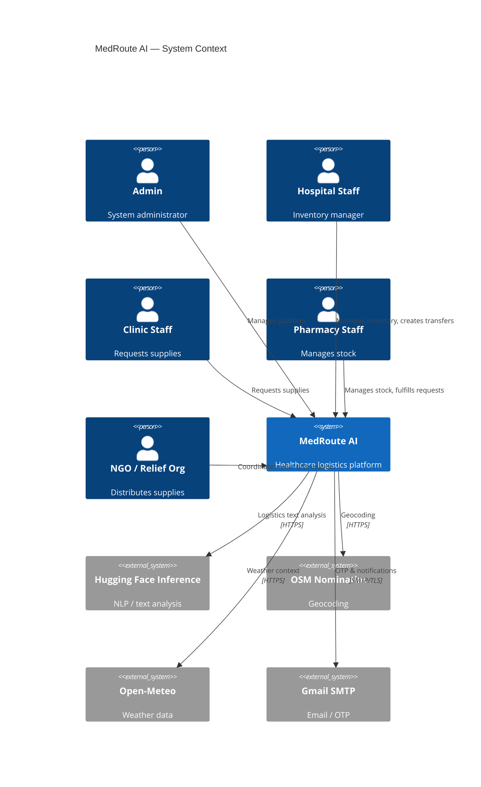
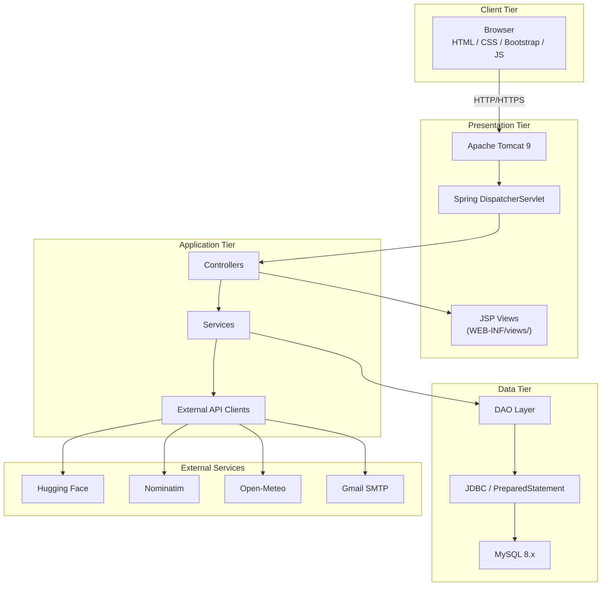
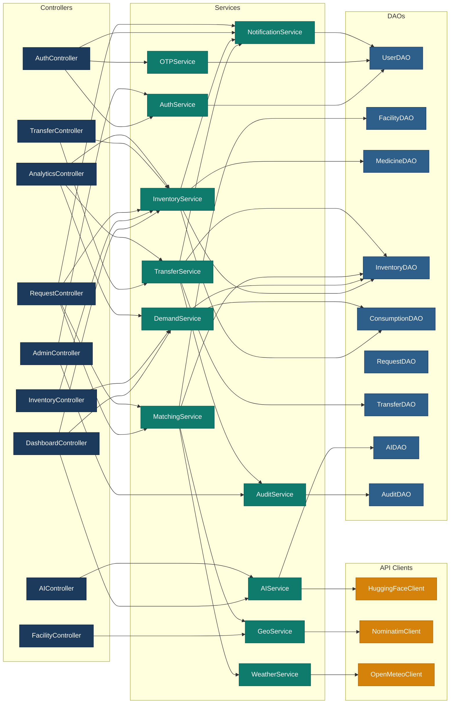
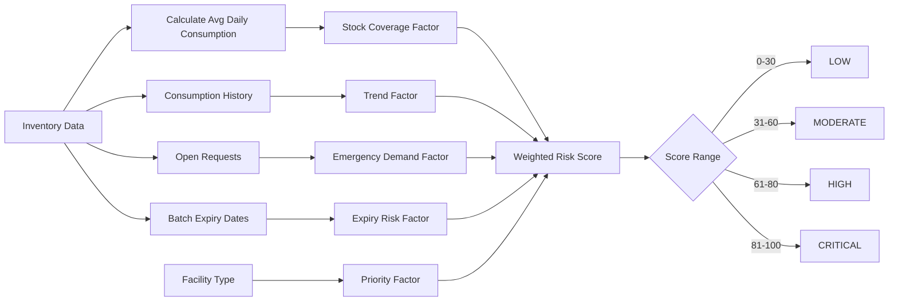
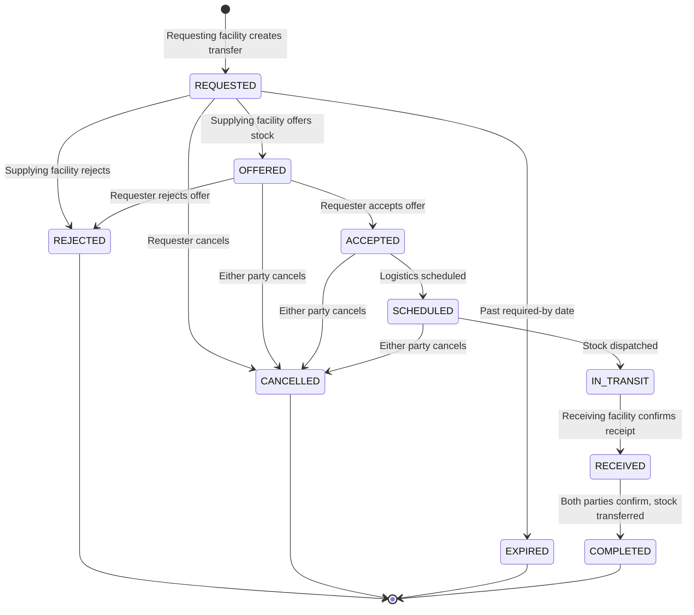
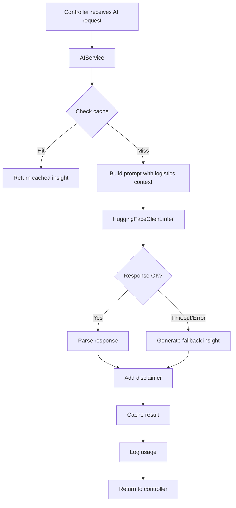
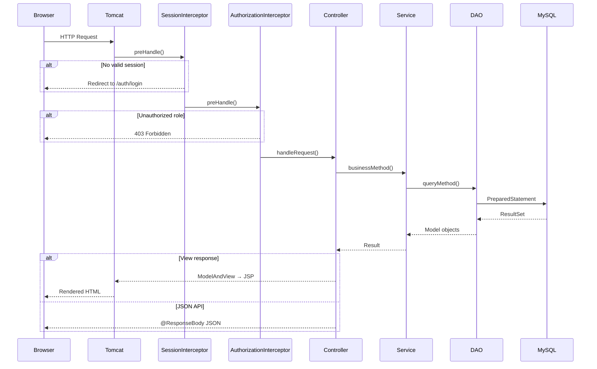

# MedRoute AI — System Architecture Document

> **Version:** 1.0  
> **Date:** 2026-08-16  
> **Status:** Architecture Contract (Phase 0)  
> **Authors:** Architecture Team  

---

## 1. Executive Summary

MedRoute AI is an intelligent healthcare **logistics and decision-support** platform that connects hospitals, clinics, pharmacies, and NGOs/relief organizations for medicine and medical-supply distribution. The system tracks inventory, consumption, shortages, expiry, emergency requests, excess stock, facility locations, and inter-facility stock transfers.

> [!IMPORTANT]
> This system is **NOT** a clinical application. It does not diagnose, prescribe, recommend treatments, store patient records, or make clinical decisions. All AI capabilities are restricted to logistics analysis, demand explanation, inventory-risk interpretation, text classification, request prioritization, and logistics recommendations.

Every AI-generated output carries the disclaimer:  
*"AI-generated logistics insight. This is not medical advice and should not be used for clinical decision-making."*

---

## 2. System Context



---

## 3. Technology Stack

| Layer | Technology | Version |
|---|---|---|
| **Language** | Java | 17 (LTS) |
| **Web Framework** | Spring MVC | 5.3.x |
| **Servlet Container** | Apache Tomcat | 9.0.x |
| **Build Tool** | Apache Maven | 3.9.x |
| **Database** | MySQL | 8.0.x |
| **Data Access** | JDBC + Spring JdbcTemplate | — |
| **View Engine** | JSP + JSTL | 2.3 / 1.2 |
| **Frontend** | HTML5, CSS3, Bootstrap 5, Vanilla JS | — |
| **Charts** | Chart.js | 4.4.x |
| **Maps** | Leaflet.js | 1.9.x |
| **Icons** | Bootstrap Icons | 1.11.x |
| **Typography** | Inter (Google Fonts) | — |
| **Email** | Spring JavaMailSender | — |
| **JSON** | Jackson | 2.15.x |
| **Logging** | SLF4J + Logback | 2.0.x / 1.4.x |
| **Password Hashing** | BCrypt | jBCrypt 0.4 |
| **Testing** | JUnit 5 + Mockito | 5.10.x / 5.x |

> [!CAUTION]
> **Excluded technologies:** Spring Boot, React, Angular, Vue, Next.js, Tailwind CSS, Thymeleaf, Hibernate/JPA, Google Maps.

---

## 4. Layered Architecture



### Layer Responsibilities

| Layer | Responsibility | Rules |
|---|---|---|
| **Controller** | HTTP request handling, input binding, response dispatch | Thin. No business logic. No SQL. |
| **Service** | Business logic, orchestration, validation, transactions | All domain logic lives here. |
| **DAO** | Data access, SQL queries, result mapping | Only JDBC. Only PreparedStatement. |
| **API Client** | External service communication | Isolated. Handles timeout, caching, fallback. |
| **Model** | Domain objects (POJOs) | No framework annotations. Clean. |
| **Security** | Authentication, authorization, encryption | Interceptors, utilities. |
| **Config** | Spring beans, datasource, mail, app wiring | Java-based @Configuration. |
| **Util** | Cross-cutting utilities | Stateless helpers. |

---

## 5. Package Structure

```
com.medroute
├── config/
│   ├── WebConfig.java              # DispatcherServlet, view resolver, interceptors, static resources
│   ├── DatabaseConfig.java         # DataSource bean, JdbcTemplate bean
│   ├── MailConfig.java             # JavaMailSender bean
│   └── AppConfig.java              # Component scan, property sources, misc beans
│
├── controller/
│   ├── AuthController.java         # Login, registration, OTP, logout
│   ├── DashboardController.java    # Role-specific dashboards
│   ├── InventoryController.java    # Stock management, batches, consumption
│   ├── RequestController.java      # Emergency supply requests
│   ├── TransferController.java     # Inter-facility transfers
│   ├── FacilityController.java     # Facility profiles, maps
│   ├── AIController.java           # AI insights, analysis endpoints
│   ├── AnalyticsController.java    # Charts, trends, reports
│   └── AdminController.java        # Admin panel, user/facility mgmt, audit
│
├── service/
│   ├── AuthService.java            # Authentication logic
│   ├── OTPService.java             # OTP generation, validation, rate limiting
│   ├── InventoryService.java       # Stock calculations, batch management
│   ├── DemandService.java          # Consumption analysis, demand patterns
│   ├── MatchingService.java        # Facility matching engine
│   ├── TransferService.java        # Transfer lifecycle, JDBC transactions
│   ├── AIService.java              # AI orchestration, caching, fallback
│   ├── GeoService.java             # Geocoding orchestration
│   ├── WeatherService.java         # Weather data orchestration
│   ├── NotificationService.java    # Email dispatch, in-app notifications
│   └── AuditService.java           # Audit log recording
│
├── dao/
│   ├── UserDAO.java                # User CRUD, authentication queries
│   ├── FacilityDAO.java            # Facility CRUD, spatial queries
│   ├── MedicineDAO.java            # Medicine catalog queries
│   ├── InventoryDAO.java           # Batch CRUD, stock queries, transactions
│   ├── ConsumptionDAO.java         # Consumption records, aggregations
│   ├── RequestDAO.java             # Emergency request CRUD
│   ├── TransferDAO.java            # Transfer lifecycle queries
│   ├── AIDAO.java                  # AI insight storage, usage logging
│   └── AuditDAO.java               # Audit log insertion, retrieval
│
├── api/
│   ├── HuggingFaceClient.java      # HF Inference API communication
│   ├── NominatimClient.java        # OSM geocoding
│   └── OpenMeteoClient.java        # Weather data retrieval
│
├── model/
│   ├── User.java
│   ├── Facility.java
│   ├── Medicine.java
│   ├── InventoryBatch.java
│   ├── EmergencyRequest.java
│   ├── TransferRequest.java
│   ├── AIInsight.java
│   └── Notification.java
│
├── security/
│   ├── PasswordUtil.java           # BCrypt hashing/verification
│   ├── OTPUtil.java                # OTP generation, SHA-256 hashing
│   ├── SessionInterceptor.java     # Session validation interceptor
│   └── AuthorizationInterceptor.java  # Role-based access interceptor
│
└── util/
    ├── DBConnection.java           # Legacy/fallback connection utility
    ├── JsonUtil.java               # Jackson serialization helpers
    ├── ValidationUtil.java         # Server-side input validation
    └── DistanceUtil.java           # Haversine distance calculation
```

---

## 6. Component Dependency Map



---

## 7. Spring Configuration Model

Since we use **Spring MVC without Spring Boot**, configuration is explicit and Java-based.

### 7.1 Servlet Container Bootstrap

```
web.xml  (or WebApplicationInitializer)
  └── DispatcherServlet
        └── WebConfig.java  (@EnableWebMvc)
              ├── ViewResolver  → /WEB-INF/views/*.jsp
              ├── ResourceHandler → /assets/**
              ├── Interceptors  → SessionInterceptor, AuthorizationInterceptor
              └── MessageConverters → Jackson JSON
```

### 7.2 Configuration Classes

| Class | Responsibility |
|---|---|
| `AppConfig` | Root context: component scan, property sources, environment variable loading |
| `WebConfig` | Servlet context: `@EnableWebMvc`, view resolver, static resources, interceptors |
| `DatabaseConfig` | `DataSource` bean (MySQL), `JdbcTemplate` bean, `DataSourceTransactionManager` |
| `MailConfig` | `JavaMailSender` bean configured from environment variables |

### 7.3 Environment Variables

| Variable | Purpose | Example |
|---|---|---|
| `DB_URL` | JDBC connection URL | `jdbc:mysql://localhost:3306/medroute_ai?useSSL=false&serverTimezone=UTC` |
| `DB_USERNAME` | Database username | `medroute_user` |
| `DB_PASSWORD` | Database password | `********` |
| `MAIL_USERNAME` | Gmail address for SMTP | `medroute.ai@gmail.com` |
| `MAIL_APP_PASSWORD` | Gmail App Password | `********` |
| `HF_TOKEN` | Hugging Face API token | `hf_xxxxxxxxxxxx` |
| `APP_BASE_URL` | Application base URL | `http://localhost:8080/MedRouteAI` |

---

## 8. Key Subsystem Designs

### 8.1 Risk Engine (Deterministic)

The risk engine is entirely Java-based — no AI model involvement in arithmetic.

```
Risk Score = (0.40 × stockCoverageFactor)
           + (0.25 × consumptionTrendFactor)
           + (0.20 × emergencyDemandFactor)
           + (0.10 × expiryRiskFactor)
           + (0.05 × facilityPriorityFactor)
```

Each factor is normalized to 0–100:

| Factor | Calculation |
|---|---|
| **Stock Coverage** | `daysOfStock = availableQty / avgDailyConsumption`. Score: 100 if < 3 days, 0 if > 30 days, linear interpolation. |
| **Consumption Trend** | Compare last 7-day average vs. previous 7-day. Rising trend → higher score. |
| **Emergency Demand** | Open emergency requests for this medicine at this facility. |
| **Expiry Risk** | Percentage of stock expiring within 30 days. |
| **Facility Priority** | Hospitals > Clinics > Pharmacies > NGOs (configurable). |

**Risk Levels:**

| Score | Level | Color |
|---|---|---|
| 0–30 | LOW | Green |
| 31–60 | MODERATE | Amber |
| 61–80 | HIGH | Orange |
| 81–100 | CRITICAL | Red |



### 8.2 Matching Engine

When an emergency request is created, the matching engine finds the best facility to fulfill it.

```
Match Score = (0.35 × proximityScore)
            + (0.25 × quantityScore)
            + (0.15 × urgencyCompatibility)
            + (0.10 × facilityReliability)
            + (0.10 × expiryHealthScore)
            + (0.05 × responseHistoryScore)
```

| Factor | Calculation |
|---|---|
| **Proximity** | Haversine distance. Score: 100 if < 5 km, 0 if > 200 km, inverse interpolation. |
| **Available Quantity** | `availableQty / requestedQty`. Capped at 100%. |
| **Urgency Compatibility** | CRITICAL requests prefer hospitals; LOW can use any facility. |
| **Facility Reliability** | Historical transfer completion rate. |
| **Expiry Health** | Exclude expired batches. Prefer batches with > 90 days remaining. |
| **Response History** | Average response time for past transfers. |

**Rules:**
- Never match expired stock
- Never match stock below minimum_stock threshold
- Prefer facilities within 50 km radius
- Return top-N matches sorted by score

### 8.3 Transfer Lifecycle



**JDBC Transaction Boundaries** on transfer completion:
1. Deduct `quantity` from source `inventory_batches`
2. Create new batch at destination (or add to existing)
3. Insert `inventory_transactions` (TRANSFERRED_OUT + TRANSFERRED_IN)
4. Update `transfer_requests.status` → COMPLETED
5. Update `emergency_requests.quantity_fulfilled` if applicable
6. All within a single JDBC transaction — rollback on any failure

### 8.4 AI Service Design



**Guardrails:**
- All prompts are server-side constructed (never from raw user input)
- System prompts explicitly instruct: "You are a logistics analyst. Do not provide medical advice."
- Response is post-processed to strip any clinical language
- Cache TTL: 1 hour for risk analysis, 15 minutes for real-time context
- Timeout: 10 seconds max per HF call
- Fallback: deterministic risk engine output formatted as natural language

---

## 9. External Service Integration Policies

| Service | Rate Limit | Cache TTL | Timeout | Fallback |
|---|---|---|---|---|
| **Hugging Face** | 10 req/min per user | 1 hour (risk), 15 min (real-time) | 10 sec | Deterministic engine output as NL |
| **Nominatim** | 1 req/sec (global) | 30 days | 5 sec | Manual lat/lng entry |
| **Open-Meteo** | No key needed, respectful | 3 hours | 5 sec | Skip weather context |
| **Gmail SMTP** | Gmail limits apply | N/A | 10 sec | Queue for retry, log failure |

---

## 10. Request/Response Flow



---

## 11. JSP View Architecture

```
src/main/webapp/
├── assets/
│   ├── css/
│   │   ├── main.css            # Design system: colors, typography, spacing
│   │   ├── components.css      # Reusable component styles
│   │   ├── dashboard.css       # Dashboard-specific styles
│   │   └── auth.css            # Auth page styles
│   ├── js/
│   │   ├── app.js              # Global JS utilities, CSRF token handling
│   │   ├── dashboard.js        # Dashboard charts and interactions
│   │   ├── inventory.js        # Inventory management JS
│   │   ├── map.js              # Leaflet map initialization
│   │   └── notifications.js    # Real-time notification polling
│   ├── images/                 # Illustrations, mascot, visual assets
│   └── icons/                  # Custom icons if needed
│
└── WEB-INF/
    └── views/
        ├── layouts/
        │   ├── base.jsp        # Master layout: head, nav, footer
        │   └── sidebar.jsp     # Role-aware sidebar fragment
        ├── auth/
        │   ├── login.jsp
        │   ├── register.jsp
        │   ├── verify-otp.jsp
        │   └── forgot-password.jsp
        ├── dashboard/
        │   ├── admin.jsp
        │   └── facility.jsp
        ├── inventory/
        │   ├── list.jsp
        │   ├── add.jsp
        │   ├── detail.jsp
        │   ├── expiring.jsp
        │   └── low-stock.jsp
        ├── requests/
        │   ├── list.jsp
        │   ├── create.jsp
        │   └── detail.jsp
        ├── transfers/
        │   ├── list.jsp
        │   └── detail.jsp
        ├── facility/
        │   ├── profile.jsp
        │   └── map.jsp
        ├── ai/
        │   └── insights.jsp
        ├── analytics/
        │   └── dashboard.jsp
        ├── admin/
        │   ├── panel.jsp
        │   ├── users.jsp
        │   ├── facilities.jsp
        │   ├── audit-logs.jsp
        │   ├── system-health.jsp
        │   └── settings.jsp
        └── errors/
            ├── 400.jsp
            ├── 403.jsp
            ├── 404.jsp
            └── 500.jsp
```

### JSP Include Strategy

All JSPs use `<%@ include %>` or `<jsp:include>` for shared fragments:
- `base.jsp` provides HTML skeleton, meta tags, CSS/JS includes, navigation
- Each view includes `base.jsp` and provides content via `<jsp:body>`
- JSTL `<c:out>` used for all dynamic content (XSS prevention)
- CSRF token rendered as hidden input on all forms

---

## 12. Design System

### Color Palette

| Token | Hex | Usage |
|---|---|---|
| `--navy-900` | `#0D2137` | Primary dark background, headers |
| `--navy-700` | `#1B3A5C` | Sidebar, secondary elements |
| `--blue-500` | `#2D7DD2` | Primary actions, links |
| `--teal-500` | `#0F7B6C` | Success states, positive indicators |
| `--teal-400` | `#14A38B` | Hover states, accents |
| `--offwhite` | `#F7F5F2` | Page background |
| `--gray-100` | `#F0EDEA` | Card backgrounds |
| `--gray-300` | `#D1CBC3` | Borders, dividers |
| `--gray-600` | `#6B6560` | Secondary text |
| `--gray-900` | `#2C2825` | Primary text |
| `--green-500` | `#4A8C5C` | Low risk, success |
| `--amber-500` | `#D4820A` | Warnings, moderate risk |
| `--red-500` | `#C4392D` | Critical alerts, errors |

### Typography

```css
--font-primary: 'Inter', -apple-system, BlinkMacSystemFont, 'Segoe UI', system-ui, sans-serif;
--font-mono: 'JetBrains Mono', 'Fira Code', 'Consolas', monospace;
```

### Spacing Scale

4px base: 4, 8, 12, 16, 20, 24, 32, 40, 48, 64, 80, 96

---

## 13. Deployment

### WAR Packaging

```
MedRouteAI.war
├── META-INF/
├── WEB-INF/
│   ├── web.xml
│   ├── classes/
│   │   └── com/medroute/...
│   ├── lib/
│   │   └── *.jar (Maven dependencies)
│   └── views/
│       └── *.jsp
└── assets/
    ├── css/
    ├── js/
    ├── images/
    └── icons/
```

### Local Deployment

```
Tomcat 9.0.x
  └── webapps/
      └── MedRouteAI.war

URL: http://localhost:8080/MedRouteAI/
```

### Environment Setup

1. Install JDK 17, set `JAVA_HOME`
2. Install MySQL 8.x, create database `medroute_ai`
3. Run `database/schema.sql` then `database/seed.sql`
4. Set environment variables (see Section 7.3)
5. Install Tomcat 9.0.x, set `CATALINA_HOME`
6. `mvn clean package -DskipTests`
7. Deploy `target/MedRouteAI.war` to `$CATALINA_HOME/webapps/`
8. Start Tomcat, access `http://localhost:8080/MedRouteAI/`

---

## 14. Cross-Cutting Concerns

### 14.1 Logging

- SLF4J facade with Logback implementation
- Log levels: ERROR (production), DEBUG (development)
- Structured log format: `timestamp | level | class | message`
- Sensitive data (passwords, OTPs, tokens) NEVER logged

### 14.2 Error Handling

- `@ControllerAdvice` global exception handler
- Custom error pages in `/WEB-INF/views/errors/`
- Generic messages to users; full stack traces in server logs only
- JSON error envelope for API endpoints: `{ "error": true, "message": "...", "code": "..." }`

### 14.3 Pagination

Standard query parameters on all list endpoints:
- `page` (default: 1)
- `size` (default: 20, max: 100)
- `sort` (column name)
- `dir` (ASC/DESC)

Response includes: `totalItems`, `totalPages`, `currentPage`, `pageSize`

### 14.4 Caching Strategy

| Data | Cache Location | TTL | Invalidation |
|---|---|---|---|
| AI insights | Database + in-memory map | 1 hour | On new data |
| Geocoding | Database (`geocoding_cache`) | 30 days | Auto-expire |
| Weather | Database (`weather_cache`) | 3 hours | Auto-expire |
| Medicine catalog | In-memory (ConcurrentHashMap) | 24 hours | On catalog update |
| Facility list | In-memory | 1 hour | On facility update |

---

## 15. Risks and Compatibility Warnings

| Risk | Impact | Mitigation |
|---|---|---|
| **Spring 5.3.x EOL** | Spring 5.3.x entered maintenance in 2024. Security patches only. | Pin exact versions. No Spring 6 migration (requires Jakarta EE 9+). |
| **javax → jakarta namespace** | Tomcat 10+ uses `jakarta.servlet`. We must stay on Tomcat 9. | Lock Tomcat to 9.0.x. Document this clearly. |
| **Hugging Face availability** | Free tier has rate limits and cold starts. | Caching, timeout, fallback to deterministic engine. |
| **Nominatim abuse** | Public service with strict fair-use policy. | 1 req/sec rate limit, 30-day cache, identifiable User-Agent. |
| **Gmail SMTP limits** | 500 emails/day for free accounts. | Rate limit OTP sends, queue notifications, consider batching. |
| **MySQL connection pooling** | Without connection pool, under load connections may exhaust. | Use HikariCP or Apache DBCP2 via `DatabaseConfig`. |
| **JSP compilation on first request** | First request to each JSP triggers compilation delay. | Pre-compile JSPs during build or warm-up. |
| **JDBC transaction isolation** | Concurrent transfers could cause stock inconsistency. | Use `SERIALIZABLE` isolation for transfer transactions. |
| **Session fixation** | Attacker could hijack session. | Regenerate session ID after login. |

---

*This document is the master architecture contract. All implementation phases must conform to these specifications. Deviations require architecture review.*
