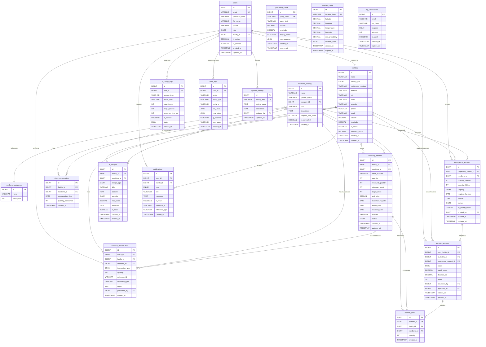

# MedRoute AI - Database Architecture

## Overview
This document outlines the database schema for the MedRoute AI healthcare logistics platform. The database is designed for MySQL 8.x, ensuring robust data integrity, compliance with 3NF normalization, and optimized performance for spatial queries and large transaction volumes.

## Entity Relationship Diagram



## DDL (CREATE TABLE Statements)

```sql
-- Disable foreign key checks for schema creation
SET FOREIGN_KEY_CHECKS = 0;

CREATE TABLE facilities (
    id BIGINT AUTO_INCREMENT PRIMARY KEY,
    name VARCHAR(255) NOT NULL,
    facility_type ENUM('HOSPITAL', 'CLINIC', 'PHARMACY', 'NGO', 'WAREHOUSE') NOT NULL,
    registration_number VARCHAR(100),
    address VARCHAR(255) NOT NULL,
    city VARCHAR(100) NOT NULL,
    state VARCHAR(100) NOT NULL,
    pincode VARCHAR(20) NOT NULL,
    phone VARCHAR(20) NOT NULL,
    email VARCHAR(255) NOT NULL,
    latitude DECIMAL(10,8),
    longitude DECIMAL(11,8),
    is_active BOOLEAN DEFAULT TRUE,
    reliability_score DECIMAL(3,2) DEFAULT 0.00,
    created_at TIMESTAMP DEFAULT CURRENT_TIMESTAMP,
    updated_at TIMESTAMP DEFAULT CURRENT_TIMESTAMP ON UPDATE CURRENT_TIMESTAMP
);

CREATE TABLE users (
    id BIGINT AUTO_INCREMENT PRIMARY KEY,
    email VARCHAR(255) NOT NULL UNIQUE,
    password_hash VARCHAR(255) NOT NULL,
    full_name VARCHAR(255) NOT NULL,
    phone VARCHAR(20) NOT NULL,
    role ENUM('ADMIN', 'HOSPITAL', 'CLINIC', 'PHARMACY', 'NGO') NOT NULL,
    facility_id BIGINT,
    is_active BOOLEAN DEFAULT TRUE,
    is_verified BOOLEAN DEFAULT FALSE,
    created_at TIMESTAMP DEFAULT CURRENT_TIMESTAMP,
    updated_at TIMESTAMP DEFAULT CURRENT_TIMESTAMP ON UPDATE CURRENT_TIMESTAMP,
    CONSTRAINT fk_users_facility FOREIGN KEY (facility_id) REFERENCES facilities(id) ON DELETE SET NULL
);

CREATE TABLE medicine_categories (
    id BIGINT AUTO_INCREMENT PRIMARY KEY,
    name VARCHAR(100) NOT NULL,
    description TEXT
);

CREATE TABLE medicine_catalog (
    id BIGINT AUTO_INCREMENT PRIMARY KEY,
    name VARCHAR(255) NOT NULL,
    generic_name VARCHAR(255),
    category_id BIGINT NOT NULL,
    unit VARCHAR(50) NOT NULL,
    description TEXT,
    requires_cold_chain BOOLEAN DEFAULT FALSE,
    is_controlled BOOLEAN DEFAULT FALSE,
    created_at TIMESTAMP DEFAULT CURRENT_TIMESTAMP,
    CONSTRAINT fk_medicine_category FOREIGN KEY (category_id) REFERENCES medicine_categories(id)
);

CREATE TABLE inventory_batches (
    id BIGINT AUTO_INCREMENT PRIMARY KEY,
    facility_id BIGINT NOT NULL,
    medicine_id BIGINT NOT NULL,
    batch_number VARCHAR(100) NOT NULL,
    quantity INT NOT NULL CHECK (quantity >= 0),
    reserved_quantity INT DEFAULT 0 CHECK (reserved_quantity >= 0 AND reserved_quantity <= quantity),
    minimum_stock INT DEFAULT 0,
    target_stock INT DEFAULT 0,
    unit_price DECIMAL(10,2),
    manufacture_date DATE,
    expiry_date DATE NOT NULL,
    received_date DATE,
    supplier VARCHAR(255),
    status ENUM('ACTIVE', 'DEPLETED', 'EXPIRED', 'RECALLED') NOT NULL DEFAULT 'ACTIVE',
    created_at TIMESTAMP DEFAULT CURRENT_TIMESTAMP,
    updated_at TIMESTAMP DEFAULT CURRENT_TIMESTAMP ON UPDATE CURRENT_TIMESTAMP,
    CONSTRAINT fk_inventory_facility FOREIGN KEY (facility_id) REFERENCES facilities(id),
    CONSTRAINT fk_inventory_medicine FOREIGN KEY (medicine_id) REFERENCES medicine_catalog(id)
);

CREATE TABLE inventory_transactions (
    id BIGINT AUTO_INCREMENT PRIMARY KEY,
    batch_id BIGINT NOT NULL,
    facility_id BIGINT NOT NULL,
    medicine_id BIGINT NOT NULL,
    transaction_type ENUM('RECEIVED', 'DISPENSED', 'TRANSFERRED_OUT', 'TRANSFERRED_IN', 'ADJUSTMENT', 'EXPIRED', 'RETURNED') NOT NULL,
    quantity INT NOT NULL,
    reference_id VARCHAR(100),
    reference_type VARCHAR(100),
    notes TEXT,
    performed_by BIGINT,
    created_at TIMESTAMP DEFAULT CURRENT_TIMESTAMP,
    CONSTRAINT fk_txn_batch FOREIGN KEY (batch_id) REFERENCES inventory_batches(id),
    CONSTRAINT fk_txn_facility FOREIGN KEY (facility_id) REFERENCES facilities(id),
    CONSTRAINT fk_txn_medicine FOREIGN KEY (medicine_id) REFERENCES medicine_catalog(id),
    CONSTRAINT fk_txn_user FOREIGN KEY (performed_by) REFERENCES users(id)
);

CREATE TABLE stock_consumption (
    id BIGINT AUTO_INCREMENT PRIMARY KEY,
    facility_id BIGINT NOT NULL,
    medicine_id BIGINT NOT NULL,
    consumption_date DATE NOT NULL,
    quantity_consumed INT NOT NULL CHECK (quantity_consumed >= 0),
    created_at TIMESTAMP DEFAULT CURRENT_TIMESTAMP,
    CONSTRAINT fk_consumption_facility FOREIGN KEY (facility_id) REFERENCES facilities(id),
    CONSTRAINT fk_consumption_medicine FOREIGN KEY (medicine_id) REFERENCES medicine_catalog(id)
);

CREATE TABLE emergency_requests (
    id BIGINT AUTO_INCREMENT PRIMARY KEY,
    requesting_facility_id BIGINT NOT NULL,
    medicine_id BIGINT NOT NULL,
    quantity_needed INT NOT NULL CHECK (quantity_needed > 0),
    quantity_fulfilled INT DEFAULT 0 CHECK (quantity_fulfilled >= 0 AND quantity_fulfilled <= quantity_needed),
    urgency ENUM('LOW', 'MEDIUM', 'HIGH', 'CRITICAL') NOT NULL,
    required_by_date DATE NOT NULL,
    reason TEXT,
    status ENUM('OPEN', 'PARTIALLY_FULFILLED', 'FULFILLED', 'EXPIRED', 'CANCELLED') NOT NULL DEFAULT 'OPEN',
    ai_priority_score DECIMAL(5,2),
    created_by BIGINT,
    created_at TIMESTAMP DEFAULT CURRENT_TIMESTAMP,
    updated_at TIMESTAMP DEFAULT CURRENT_TIMESTAMP ON UPDATE CURRENT_TIMESTAMP,
    CONSTRAINT fk_emergency_facility FOREIGN KEY (requesting_facility_id) REFERENCES facilities(id),
    CONSTRAINT fk_emergency_medicine FOREIGN KEY (medicine_id) REFERENCES medicine_catalog(id),
    CONSTRAINT fk_emergency_user FOREIGN KEY (created_by) REFERENCES users(id)
);

CREATE TABLE transfer_requests (
    id BIGINT AUTO_INCREMENT PRIMARY KEY,
    from_facility_id BIGINT NOT NULL,
    to_facility_id BIGINT NOT NULL,
    emergency_request_id BIGINT,
    status ENUM('REQUESTED', 'OFFERED', 'ACCEPTED', 'SCHEDULED', 'IN_TRANSIT', 'RECEIVED', 'COMPLETED', 'REJECTED', 'CANCELLED', 'EXPIRED') NOT NULL DEFAULT 'REQUESTED',
    match_score DECIMAL(5,2),
    distance_km DECIMAL(8,2),
    notes TEXT,
    requested_by BIGINT,
    approved_by BIGINT,
    created_at TIMESTAMP DEFAULT CURRENT_TIMESTAMP,
    updated_at TIMESTAMP DEFAULT CURRENT_TIMESTAMP ON UPDATE CURRENT_TIMESTAMP,
    CONSTRAINT fk_transfer_from FOREIGN KEY (from_facility_id) REFERENCES facilities(id),
    CONSTRAINT fk_transfer_to FOREIGN KEY (to_facility_id) REFERENCES facilities(id),
    CONSTRAINT fk_transfer_emergency FOREIGN KEY (emergency_request_id) REFERENCES emergency_requests(id),
    CONSTRAINT fk_transfer_req_user FOREIGN KEY (requested_by) REFERENCES users(id),
    CONSTRAINT fk_transfer_app_user FOREIGN KEY (approved_by) REFERENCES users(id)
);

CREATE TABLE transfer_items (
    id BIGINT AUTO_INCREMENT PRIMARY KEY,
    transfer_id BIGINT NOT NULL,
    batch_id BIGINT NOT NULL,
    medicine_id BIGINT NOT NULL,
    quantity INT NOT NULL CHECK (quantity > 0),
    created_at TIMESTAMP DEFAULT CURRENT_TIMESTAMP,
    CONSTRAINT fk_titem_transfer FOREIGN KEY (transfer_id) REFERENCES transfer_requests(id),
    CONSTRAINT fk_titem_batch FOREIGN KEY (batch_id) REFERENCES inventory_batches(id),
    CONSTRAINT fk_titem_medicine FOREIGN KEY (medicine_id) REFERENCES medicine_catalog(id)
);

CREATE TABLE ai_insights (
    id BIGINT AUTO_INCREMENT PRIMARY KEY,
    facility_id BIGINT,
    medicine_id BIGINT,
    insight_type ENUM('SHORTAGE_RISK', 'EXPIRY_ALERT', 'DEMAND_FORECAST', 'TREND_ANALYSIS', 'LOGISTICS_RECOMMENDATION') NOT NULL,
    title VARCHAR(255) NOT NULL,
    content TEXT NOT NULL,
    severity ENUM('INFO', 'WARNING', 'CRITICAL') NOT NULL,
    risk_score DECIMAL(5,2),
    metadata JSON,
    is_read BOOLEAN DEFAULT FALSE,
    created_at TIMESTAMP DEFAULT CURRENT_TIMESTAMP,
    expires_at TIMESTAMP NULL,
    CONSTRAINT fk_insight_facility FOREIGN KEY (facility_id) REFERENCES facilities(id),
    CONSTRAINT fk_insight_medicine FOREIGN KEY (medicine_id) REFERENCES medicine_catalog(id)
);

CREATE TABLE ai_usage_logs (
    id BIGINT AUTO_INCREMENT PRIMARY KEY,
    user_id BIGINT NOT NULL,
    request_type VARCHAR(100) NOT NULL,
    model_used VARCHAR(100) NOT NULL,
    input_tokens INT,
    output_tokens INT,
    response_time_ms INT,
    is_cached BOOLEAN DEFAULT FALSE,
    status ENUM('SUCCESS', 'FAILED', 'TIMEOUT', 'FALLBACK') NOT NULL,
    created_at TIMESTAMP DEFAULT CURRENT_TIMESTAMP,
    CONSTRAINT fk_ai_log_user FOREIGN KEY (user_id) REFERENCES users(id)
);

CREATE TABLE geocoding_cache (
    id BIGINT AUTO_INCREMENT PRIMARY KEY,
    query_hash VARCHAR(64) NOT NULL UNIQUE,
    query_text VARCHAR(255) NOT NULL,
    latitude DECIMAL(10,8) NOT NULL,
    longitude DECIMAL(11,8) NOT NULL,
    display_name VARCHAR(500),
    raw_response JSON,
    created_at TIMESTAMP DEFAULT CURRENT_TIMESTAMP,
    expires_at TIMESTAMP NULL
);

CREATE TABLE weather_cache (
    id BIGINT AUTO_INCREMENT PRIMARY KEY,
    location_hash VARCHAR(64) NOT NULL UNIQUE,
    latitude DECIMAL(10,8) NOT NULL,
    longitude DECIMAL(11,8) NOT NULL,
    temperature DECIMAL(5,2),
    humidity DECIMAL(5,2),
    rain_probability DECIMAL(5,2),
    weather_data JSON,
    created_at TIMESTAMP DEFAULT CURRENT_TIMESTAMP,
    expires_at TIMESTAMP NULL
);

CREATE TABLE notifications (
    id BIGINT AUTO_INCREMENT PRIMARY KEY,
    user_id BIGINT NOT NULL,
    facility_id BIGINT,
    type ENUM('OTP', 'LOW_STOCK', 'CRITICAL_STOCK', 'EXPIRY_WARNING', 'TRANSFER_REQUEST', 'TRANSFER_UPDATE', 'SYSTEM') NOT NULL,
    title VARCHAR(255) NOT NULL,
    message TEXT NOT NULL,
    is_read BOOLEAN DEFAULT FALSE,
    reference_id VARCHAR(100),
    reference_type VARCHAR(100),
    created_at TIMESTAMP DEFAULT CURRENT_TIMESTAMP,
    CONSTRAINT fk_notification_user FOREIGN KEY (user_id) REFERENCES users(id),
    CONSTRAINT fk_notification_facility FOREIGN KEY (facility_id) REFERENCES facilities(id)
);

CREATE TABLE audit_logs (
    id BIGINT AUTO_INCREMENT PRIMARY KEY,
    user_id BIGINT,
    action VARCHAR(100) NOT NULL,
    entity_type VARCHAR(100) NOT NULL,
    entity_id VARCHAR(100) NOT NULL,
    old_value JSON,
    new_value JSON,
    ip_address VARCHAR(45),
    user_agent VARCHAR(255),
    created_at TIMESTAMP DEFAULT CURRENT_TIMESTAMP,
    CONSTRAINT fk_audit_user FOREIGN KEY (user_id) REFERENCES users(id) ON DELETE SET NULL
);

CREATE TABLE otp_verifications (
    id BIGINT AUTO_INCREMENT PRIMARY KEY,
    email VARCHAR(255) NOT NULL,
    otp_hash VARCHAR(255) NOT NULL,
    purpose ENUM('REGISTRATION', 'LOGIN', 'PASSWORD_RESET') NOT NULL,
    attempts INT DEFAULT 0,
    is_used BOOLEAN DEFAULT FALSE,
    created_at TIMESTAMP DEFAULT CURRENT_TIMESTAMP,
    expires_at TIMESTAMP NULL
);

CREATE TABLE system_settings (
    id BIGINT AUTO_INCREMENT PRIMARY KEY,
    setting_key VARCHAR(100) NOT NULL UNIQUE,
    setting_value TEXT NOT NULL,
    description TEXT,
    updated_by BIGINT,
    updated_at TIMESTAMP DEFAULT CURRENT_TIMESTAMP ON UPDATE CURRENT_TIMESTAMP,
    CONSTRAINT fk_settings_user FOREIGN KEY (updated_by) REFERENCES users(id) ON DELETE SET NULL
);

SET FOREIGN_KEY_CHECKS = 1;
```

## Indexes

| Table | Index Name | Columns | Type | Description |
|---|---|---|---|---|
| `users` | `idx_users_email` | `email` | UNIQUE | Fast lookup for authentication. |
| `facilities` | `idx_facilities_city` | `city` | B-TREE | Optimized region-based facility search. |
| `facilities` | `idx_facilities_location` | `latitude`, `longitude` | B-TREE | Enables spatial filtering of nearby locations. |
| `inventory_batches` | `idx_inv_batch_facility` | `facility_id` | B-TREE | Fast lookup of inventory by facility. |
| `inventory_batches` | `idx_inv_batch_medicine` | `medicine_id` | B-TREE | Efficient product search within batches. |
| `inventory_batches` | `idx_inv_batch_expiry` | `expiry_date` | B-TREE | Fast identification of expiring stock for alerts. |
| `emergency_requests` | `idx_emerg_req_status` | `status` | B-TREE | Optimized lookup for active requests. |
| `transfer_requests` | `idx_trans_req_status` | `status` | B-TREE | Fast queries on transfer statuses. |

## Normalization (3NF Compliance)

The schema adheres strictly to Third Normal Form (3NF):
1. **1NF**: Every table has a primary key. There are no repeating groups; repeating attributes like list of transfer items have been broken out into `transfer_items`.
2. **2NF**: All non-key attributes are fully functionally dependent on the primary key. For example, in `transfer_items`, the quantity depends strictly on `id`, not a composite key.
3. **3NF**: There are no transitive dependencies. Medicine details are isolated in `medicine_catalog` and `medicine_categories`, instead of being repeated in `inventory_batches`. Facility addresses are stored in `facilities`, preventing redundant geographic data.

## Data Integrity Constraints
1. **CHECK Constraints**: Built into tables to prevent logically impossible values (e.g., `quantity >= 0`, `reserved_quantity <= quantity`, `quantity_fulfilled <= quantity_needed`).
2. **Foreign Key Restraints**: Properly enforced cascading and restricted deletions to avoid orphaned data (`ON DELETE SET NULL` applied selectively to non-critical relationships like audit logs, while restricting deletes on active inventory).
3. **Unique Keys**: Guaranteed via `UNIQUE` constraints on user emails, system setting keys, and geocoding hashes.

## Partitioning Recommendations for Large Tables

### `audit_logs`
Due to rapid growth, partition by **RANGE** on the `created_at` timestamp (e.g., monthly). This enables easy archival or purging of old logs without scanning the full table.
```sql
ALTER TABLE audit_logs PARTITION BY RANGE (UNIX_TIMESTAMP(created_at)) (
    PARTITION p2026_08 VALUES LESS THAN (UNIX_TIMESTAMP('2026-09-01 00:00:00')),
    PARTITION p2026_09 VALUES LESS THAN (UNIX_TIMESTAMP('2026-10-01 00:00:00'))
    -- Add more partitions as needed
);
```

### `inventory_transactions`
Since logistics generates significant transactions, partition by **RANGE** on `created_at` or partition by **LIST** on `facility_id` if specific regions or large facilities generate vastly larger transaction volumes than others. Range partitioning by month is typically best for historical analysis and performance of time-bound reports.

```sql
ALTER TABLE inventory_transactions PARTITION BY RANGE (UNIX_TIMESTAMP(created_at)) (
    PARTITION p2026_Q3 VALUES LESS THAN (UNIX_TIMESTAMP('2026-10-01 00:00:00')),
    PARTITION p2026_Q4 VALUES LESS THAN (UNIX_TIMESTAMP('2027-01-01 00:00:00'))
);
```
