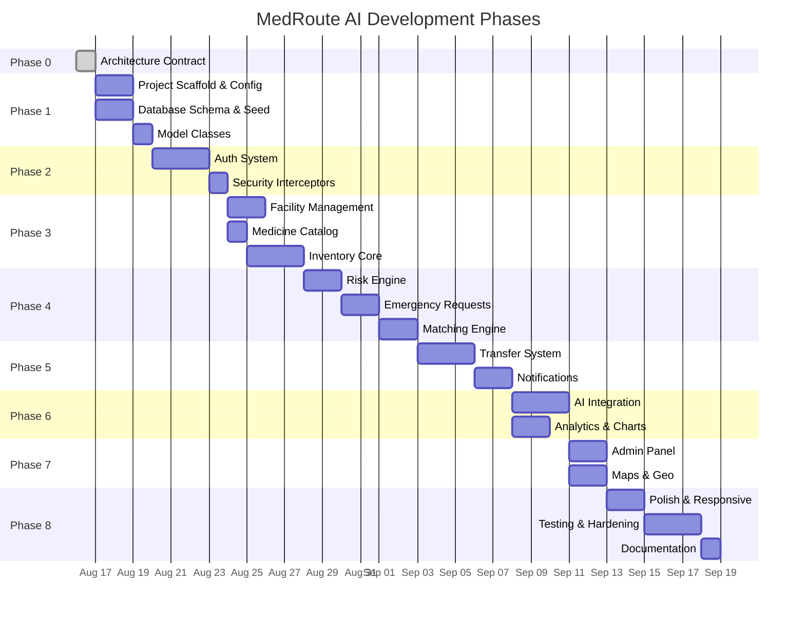
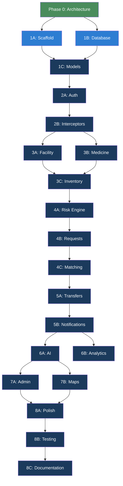

# MedRoute AI — Implementation Sequence

> **Version:** 1.0  
> **Date:** 2026-08-16  
> **Purpose:** Phased development roadmap with dependencies, deliverables, and validation criteria.

---

## Phase Overview

---

## Phase 1: Foundation

### 1A — Project Scaffold & Configuration (2 days)

**Deliverables:**
- `pom.xml` with all dependencies
- `web.xml` or `WebApplicationInitializer`
- `AppConfig.java` — root context, component scan, property sources
- `WebConfig.java` — `@EnableWebMvc`, view resolver, resource handlers, interceptors (placeholder)
- `DatabaseConfig.java` — DataSource, JdbcTemplate, TransactionManager
- `MailConfig.java` — JavaMailSender bean
- `.env.example` — documented environment variable template
- `logback.xml` — logging configuration
- Base JSP layout (`base.jsp`, `sidebar.jsp`)
- `main.css` — design system tokens (colors, typography, spacing)
- `app.js` — global utilities, CSRF token handling

**Validation:**
- Application deploys to Tomcat without errors
- Root URL (`/MedRouteAI/`) returns a placeholder page
- DataSource connects to MySQL successfully

**Dependencies:** Phase 0 (Architecture)

---

### 1B — Database Schema & Seed Data (2 days)

**Deliverables:**
- `database/schema.sql` — all 18 tables with constraints, indexes, foreign keys
- `database/seed.sql` — sample data for development:
  - 1 admin user
  - 3 hospitals, 2 clinics, 2 pharmacies, 1 NGO (with real Indian city coordinates)
  - 20+ medicines across 5 categories
  - Sample inventory batches
  - Sample consumption records (30 days)

**Validation:**
- Schema runs cleanly on fresh MySQL database
- Seed data loads without FK violations
- All indexes created

**Dependencies:** Phase 0

---

### 1C — Model Classes (1 day)

**Deliverables:**
- All 8 model POJOs with proper fields, constructors, getters/setters
- Enum types where applicable (role, facility type, status enums)

**Validation:**
- Models match database schema exactly
- No framework dependencies in model classes

**Dependencies:** Phase 1B

---

## Phase 2: Authentication & Security

### 2A — Authentication System (3 days)

**Deliverables:**
- `PasswordUtil` — BCrypt hash/verify
- `OTPUtil` — OTP generation, SHA-256 hashing
- `UserDAO` — user CRUD, find by email, update password
- `OTPService` — generate, validate, rate-limit
- `AuthService` — register, login, verify OTP, reset password
- `NotificationService` — send OTP email (basic version)
- `AuthController` — all auth endpoints
- Auth JSPs: login, register, verify-otp, forgot-password
- Auth CSS: auth page styling with tasteful illustrations

**Validation:**
- Registration → OTP email → verification → login works end-to-end
- BCrypt passwords stored in database
- OTP expires after 5 minutes
- Rate limiting prevents OTP spam
- Invalid credentials show appropriate errors

**Dependencies:** Phase 1

---

### 2B — Security Interceptors (1 day)

**Deliverables:**
- `SessionInterceptor` — validate session on protected URLs
- `AuthorizationInterceptor` — role-based URL access control
- Register interceptors in `WebConfig`
- Error pages: 400, 403, 404, 500 JSPs

**Validation:**
- Unauthenticated requests redirect to login
- Wrong-role access returns 403
- Session timeout works (30 minutes)
- Error pages render correctly

**Dependencies:** Phase 2A

---

## Phase 3: Core Inventory

### 3A — Facility Management (2 days)

**Deliverables:**
- `FacilityDAO` — CRUD, spatial queries, search
- `GeoService` + `NominatimClient` — geocoding with caching
- `FacilityController` — profile, map view
- Facility JSPs: profile, map (Leaflet.js)

**Validation:**
- Facility profile editable by facility users
- Geocoding caches results
- Leaflet map shows facility locations
- Nearby facility search works

**Dependencies:** Phase 2B

---

### 3B — Medicine Catalog (1 day)

**Deliverables:**
- `MedicineDAO` — catalog CRUD, search, category queries
- Medicine catalog seed data with categories

**Validation:**
- Medicine search returns filtered results
- Categories organize medicines correctly

**Dependencies:** Phase 2B

---

### 3C — Inventory Management (3 days)

**Deliverables:**
- `InventoryDAO` — batch CRUD, stock queries, transaction recording
- `ConsumptionDAO` — consumption recording, aggregation
- `InventoryService` — add batch, dispense, adjust, stock calculations
- `InventoryController` — all inventory endpoints + AJAX APIs
- Inventory JSPs: list (with pagination/filters), add, detail, expiring, low-stock
- `inventory.js` — client-side interactions

**Validation:**
- Add/view/edit inventory batches
- Record dispensing, see stock decrease
- Pagination works on inventory list
- Expiring stock view shows correct batches
- Low stock view shows items below minimum

**Dependencies:** Phase 3A, 3B

---

## Phase 4: Intelligence & Requests

### 4A — Risk Engine (2 days)

**Deliverables:**
- `DemandService` — consumption averages, trend calculation
- Risk score calculation in `InventoryService`
- Risk indicators in inventory views
- Risk dashboard widget

**Validation:**
- Risk scores calculate correctly with sample data
- Risk levels (LOW/MODERATE/HIGH/CRITICAL) display with correct colors
- Consumption trends compute accurately

**Dependencies:** Phase 3C

---

### 4B — Emergency Requests (2 days)

**Deliverables:**
- `RequestDAO` — CRUD, status management
- Emergency request service logic
- `RequestController` — all request endpoints
- Request JSPs: list, create, detail

**Validation:**
- Create emergency request with urgency and required-by date
- Request list shows correct statuses
- Facility can only see their own requests (except admin)

**Dependencies:** Phase 4A

---

### 4C — Matching Engine (2 days)

**Deliverables:**
- `MatchingService` — weighted scoring, Haversine distance
- `DistanceUtil` — Haversine formula
- Match results API endpoint
- Match results display in request detail view

**Validation:**
- Matching returns ranked facilities
- Distance calculations are accurate
- Expired stock excluded from matches
- Below-minimum stock excluded

**Dependencies:** Phase 4B

---

## Phase 5: Transfers & Notifications

### 5A — Transfer System (3 days)

**Deliverables:**
- `TransferDAO` — lifecycle queries, item management
- `TransferService` — state machine, JDBC transactions for completion
- `TransferController` — all transfer endpoints
- Transfer JSPs: list, detail (with state-transition actions)

**Validation:**
- Full transfer lifecycle: REQUESTED → COMPLETED
- JDBC transaction atomicity on completion
- Stock correctly moves between facilities
- Cancellation and rejection paths work
- Audit log entries created

**Dependencies:** Phase 4C

---

### 5B — Notification System (2 days)

**Deliverables:**
- Full `NotificationService` — all notification types
- Notification polling endpoint
- Notification dropdown in navigation
- Email notifications for critical events
- Low-stock and expiry alert generation (scheduled or on-demand)

**Validation:**
- In-app notifications appear for relevant events
- Email sent for OTP, critical stock, transfer updates
- Notifications mark as read
- Notification count badge updates

**Dependencies:** Phase 5A

---

## Phase 6: AI & Analytics

### 6A — AI Integration (3 days)

**Deliverables:**
- `HuggingFaceClient` — API communication, timeout, error handling
- `AIService` — prompt construction, caching, fallback, disclaimer
- `AIDAO` — insight storage, usage logging
- `AIController` — insight endpoints
- AI insights JSP
- Usage statistics for admin

**Validation:**
- AI analysis returns meaningful logistics insights
- Cache prevents redundant API calls
- Timeout and fallback work when HF is unavailable
- All responses include disclaimer
- Usage logged correctly

**Dependencies:** Phase 5B (needs full data context)

---

### 6B — Analytics & Charts (2 days)

**Deliverables:**
- `AnalyticsController` — all analytics endpoints
- Analytics JSP with Chart.js charts:
  - Inventory trend lines
  - Transfer volume bars
  - Facility performance radar
  - Demand pattern heatmap
  - Risk distribution pie/donut

**Validation:**
- Charts render with real data
- Date range filtering works
- Charts are responsive
- Data matches underlying queries

**Dependencies:** Phase 5B

---

## Phase 7: Admin & Maps

### 7A — Admin Panel (2 days)

**Deliverables:**
- `AdminController` — all admin endpoints
- `AuditDAO` + `AuditService` — audit log queries
- Admin JSPs: panel, users, facilities, audit-logs, system-health, settings
- API health check (HF, Nominatim, Open-Meteo, SMTP)

**Validation:**
- Admin can manage users and facilities
- Audit logs searchable and paginated
- API health checks return accurate status
- System settings editable

**Dependencies:** Phase 6A

---

### 7B — Maps & Geospatial (2 days)

**Deliverables:**
- `WeatherService` + `OpenMeteoClient` — weather context
- Enhanced Leaflet maps:
  - Facility map with clustering
  - Transfer route visualization
  - Risk heatmap overlay
- Weather context in transfer planning

**Validation:**
- Maps show all facilities with correct markers
- Transfer routes draw correctly
- Weather data displays where relevant
- Map is responsive

**Dependencies:** Phase 6A

---

## Phase 8: Polish & Ship

### 8A — Responsive Design & Polish (2 days)

**Deliverables:**
- Responsive breakpoints for all views (desktop, tablet, mobile)
- Hover states, micro-animations, transitions
- Empty states with illustrations
- Loading states
- 404 page with illustration
- Accessibility audit (ARIA, keyboard nav, contrast, alt text)

**Validation:**
- All pages usable on mobile (375px+)
- No broken layouts at any breakpoint
- Keyboard navigation works
- Color contrast passes WCAG AA

---

### 8B — Testing & Security Hardening (3 days)

**Deliverables:**
- Unit tests for services (JUnit 5 + Mockito)
- Integration tests for DAOs
- CSRF token validation on all forms
- XSS prevention audit
- SQL injection audit
- Session fixation prevention
- Input validation completeness check
- Error handling audit
- Performance review (query optimization, N+1 checks)

**Validation:**
- All tests pass
- No SQL injection vectors
- No XSS vectors
- No CSRF vulnerabilities
- Response times acceptable

---

### 8C — Documentation (1 day)

**Deliverables:**
- Updated `README.md` with setup instructions
- API documentation
- Database schema documentation
- Deployment guide
- User manual outline

---

## Dependency Chain Summary

---

*Each phase must be validated before proceeding to the next. No phase should be started until its dependencies are complete.*
