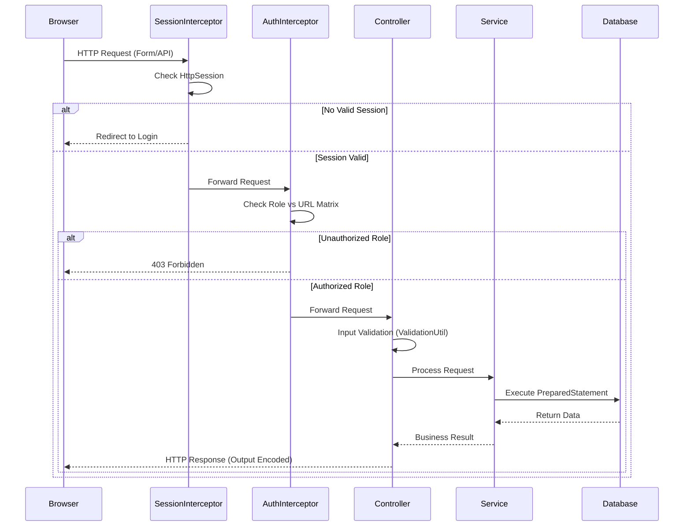

# Security Model

This document outlines the security architecture for the MedRoute AI application, covering authentication, authorization, data protection, and application-level security measures.

## 1. Authentication

### Registration Flow
- **Process**: User submits email and password.
- **Verification**: An OTP is sent via Gmail SMTP.
- **Activation**: User enters OTP to verify and activate the account.

### Login Flow
- **Credentials**: User provides email and password.
- **Verification**: Password verified using BCrypt.
- **Session Creation**: A new `HttpSession` is created.
- **Session Attributes**: `userId`, `role`, and `facilityId` are stored in the session.

### Session Management
- **Mechanism**: Servlet `HttpSession`.
- **Timeout**: 30 minutes of inactivity.
- **Protection**: Session fixation protection strategies employed upon authentication.

### Password Reset
- **Flow**: User requests reset -> OTP sent to email -> User verifies OTP -> User provides new password.

## 2. Password Security
- **Hashing**: BCrypt with a work factor/cost of 12.
- **Policy**: Minimum 8 characters, requiring at least 1 uppercase letter, 1 lowercase letter, 1 digit, and 1 special character.
- **Storage**: Plaintext passwords are **never** stored in the database or logs.

## 3. OTP Security
- **Format**: 6-digit numeric code.
- **Storage**: SHA-256 hashed before storing in the database.
- **Expiry**: 5-minute validity window.
- **Attempts**: Maximum of 3 verification attempts per OTP.
- **Rate Limiting**: Maximum 3 OTP generation requests per email per 15 minutes.
- **Reuse**: Used OTPs are marked and cannot be reused.

## 4. Authorization (RBAC)

Role-Based Access Control is enforced centrally.

- **Roles**: `ADMIN`, `HOSPITAL`, `CLINIC`, `PHARMACY`, `NGO`.
- **Session Interception**: `SessionInterceptor` validates active sessions on all protected URLs.
- **Authorization Interception**: `AuthorizationInterceptor` validates role-based access for requested paths.

### Role-URL Permission Matrix

| URL Pattern | ADMIN | HOSPITAL | CLINIC | PHARMACY | NGO |
| --- | --- | --- | --- | --- | --- |
| `/admin/**` | ✅ | ❌ | ❌ | ❌ | ❌ |
| `/dashboard/hospital/**` | ❌ | ✅ | ❌ | ❌ | ❌ |
| `/dashboard/clinic/**` | ❌ | ❌ | ✅ | ❌ | ❌ |
| `/dashboard/pharmacy/**`| ❌ | ❌ | ❌ | ✅ | ❌ |
| `/dashboard/ngo/**` | ❌ | ❌ | ❌ | ❌ | ✅ |
| `/inventory/**` | ✅ | ✅ | ✅ | ✅ | ❌ |
| `/transfer/**` | ✅ | ✅ | ✅ | ✅ | ✅ |
| `/api/**` | ✅ | ✅ | ✅ | ✅ | ✅ |

### Data-Level Authorization
- Users can **only** access data (inventory, transfers, reports) associated with their own `facilityId`.
- The `ADMIN` role bypasses facility-level data restrictions.

## 5. Input Validation & Defense

- **Server-Side Validation**: All incoming data is rigorously validated on the server side using a central `ValidationUtil`.
- **Client-Side Validation**: HTML5 and JavaScript validation for immediate UX feedback.
- **SQL Injection**: `PreparedStatement` is used for **ALL** database interactions. String concatenation for SQL queries is strictly prohibited.
- **Cross-Site Scripting (XSS)**: Output encoding is enforced in JSTL views using `<c:out>` and `fn:escapeXml`.
- **Cross-Site Request Forgery (CSRF)**: CSRF tokens are generated and validated on all state-changing forms (POST, PUT, DELETE).

## 6. API Security

- **Secrets Management**: The `HF_TOKEN` (Hugging Face) and SMTP credentials are provided via environment variables. They are never hardcoded or tracked in version control.
- **Client-Side Exposure**: No API keys are exposed to client-side JavaScript. All 3rd-party API calls are brokered by the server.
- **Rate Limiting**: Strict rate limiting applied to AI inference endpoints to prevent abuse and manage costs.
- **Request Validation**: All API endpoints enforce stringent request payload validation.

## 7. Audit Logging

- **Events Logged**: Login, logout, failed login attempts, critical data modifications, inventory transfers, and all admin actions.
- **Log Structure**: `user_id`, `action`, `entity_type`, `entity_id`, `old_value`, `new_value`, `ip_address`, `user_agent`, `timestamp`.
- **Immutability**: Audit logs are append-only. Deletion or modification of audit records is prohibited.

## 8. Error Handling

- **Custom Error Pages**: Mapped to standard HTTP error codes (400, 403, 404, 500) for a uniform user experience.
- **Information Disclosure**: Stack traces and raw internal error messages are **never** exposed to the user.
- **Logging**: Comprehensive error details (including stack traces) are logged server-side.
- **User Feedback**: Generic, friendly error messages are presented to users.

## 9. Data Flow Security Diagram

